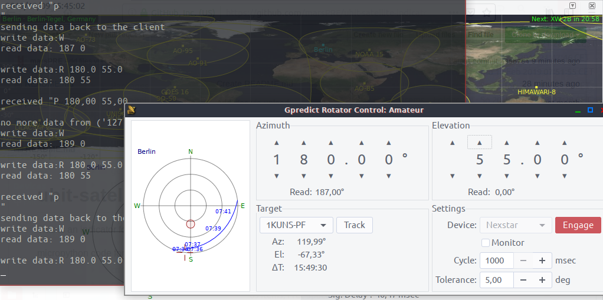

# ubit-satellite-indicator

Microbit to indicate elevation and azimut of satellites tracked with gpredict.

Hardware:

- BBC Microbit
- Laptop / Rpi running gpredict
- Yagi antenna

Software:

- MicroPython code for Microbit (installed using mu-editor)
- Python script to rleay communication between microbit and gpredict

Gpredict Rotator Interfaces setting:
Host: localhost Post:4534

This is an indicator for positions of satellites using

micropython code for BBC ubiton 

gpredict with antenna rotor communicating with socket

python program with socket to communicate between gpredict  and microbit

